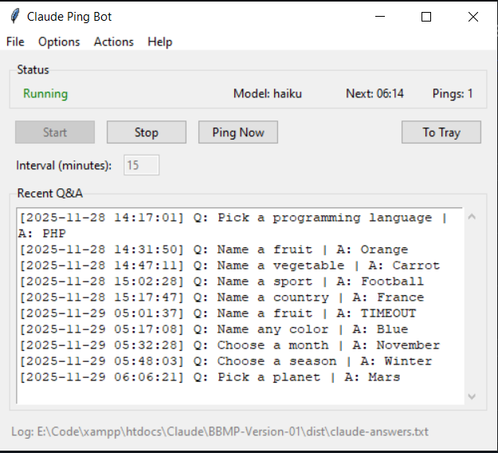

# Claude Ping Bot Pro - Portable Executable



A portable Windows application that keeps your Claude CLI session active by sending periodic ping requests.

## Download

**[Download ClaudePingBot-Pro.exe](https://github.com/ByteStackr/Claude-PingBot/releases/download/ClaudePingBot/ClaudePingBot-Pro.exe)** (~28MB)

## Quick Start

1. Download `ClaudePingBot-Pro.exe`
2. Place anywhere on your Windows PC
3. Double-click to launch
4. Click **Start** to begin pinging

No installation required - fully portable.

## Requirements

- Windows 10/11
- [Claude CLI](https://claude.ai/download) installed and authenticated
- Claude CLI must be in PATH (accessible from command line)

## Features

✓ **System Tray** - Runs silently in background
✓ **Model Selection** - Choose Haiku, Sonnet, or Opus
✓ **Flexible Intervals** - 5, 15, 30, or 60 minutes
✓ **Activity Logging** - All Q&A saved with timestamps
✓ **Menu System** - Full menu bar for control

## Usage

### Starting
- Click **Start** button, or
- Menu: **File > Start Bot**

### Minimizing to Tray
- Click **To Tray** button, or
- Menu: **File > Minimize to Tray**
- Right-click tray icon for quick actions

### Changing Model
- Menu: **Options > Model** > Select model
- Takes effect on next ping

### Setting Interval
- Menu: **Options > Interval** > Select time
- Or type directly in interval field

### Viewing Logs
- Log display shows recent Q&A
- Full log saved to `claude-answers.txt` (same folder as exe)
- Menu: **Actions > Open Log File**

## Menu Reference

| Menu | Actions |
|------|---------|
| **File** | Start Bot, Stop Bot, Minimize to Tray ✓, Exit |
| **Options** | Model (Haiku/Sonnet/Opus), Interval (5/15/30/60 min) |
| **Actions** | Ping Now, Clear Log Display, Open Log File |
| **Help** | About |

## Log File Format

`claude-answers.txt` contains all pings:

```
[2025-11-29 06:04:53] Q: Pick a programming language | A: PHP
[2025-11-29 06:19:21] Q: Name any color | A: Blue
```

## Troubleshooting

**"ERROR: claude not found"**
- Install Claude CLI: https://claude.ai/download
- Verify: Open cmd and type `claude --version`
- Restart the application

**Pings timing out**
- Check internet connection
- Switch to Haiku model (faster)
- Check Claude CLI is authenticated

**System tray icon missing**
- Click "To Tray" button first
- Check Windows notification area settings
- Icon appears after minimizing

## Technical Details

- Built with Python 3.11, Tkinter, PyInstaller
- Uses `claude -p` for non-interactive mode
- Uses `--model` flag for model selection
- 120-second timeout per ping
- Runs pings in background thread

## Models

- **Haiku** - Fastest, cheapest, recommended for pinging
- **Sonnet** - Balanced speed and quality
- **Opus** - Most capable, slower and more expensive

## Privacy

- All pings logged locally only
- No data sent anywhere except Claude CLI
- Log file stays on your machine

## Version

**Claude Ping Bot Pro v1.0**

## Support

For issues or questions about Claude CLI:
- Visit: https://claude.ai/help

## License

Free to use and distribute
